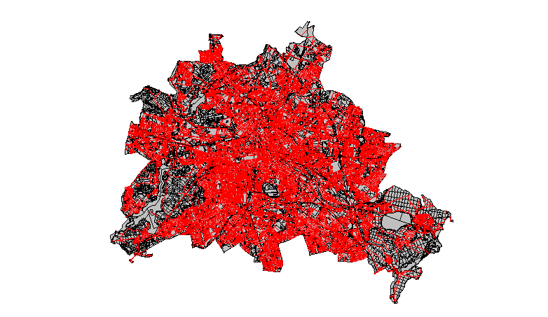

# An SWT Map View
This repository contains a map view that draws GeoJSON features directly on a
SWT canvas. We will probably use this for regionalization features in
[openLCA](https://github.com/GreenDelta/olca-app). It supports multiple layers,
zooming, dragging, colors etc. it depends only on
[SWT](https://www.eclipse.org/swt/) and the GeoJSON implementation of the
[olca-geo module](https://github.com/GreenDelta/olca-modules).

## Usage

### Adding a layer

```java
FeatureCollection watersheds = ... ;
Composite parent = ...;
MapView map = new MapView(parent);
map.addLayer(watersheds);
```


### Apply a color scale on a numeric feature parameter

```java
map.addLayer(watersheds)
   .fillScale("Annual non-agri");
```


### Put a layer on top of another layer

```java
MapView map = new MapView(shell);
map.addLayer(berlinDistricts)
  .center(); // center the map around this layer
map.addLayer(berlinBlocks)
  .fillColor(grey);
map.addLayer(berlinStreets)
  .fillColor(red)
  .borderColor(red);
```

