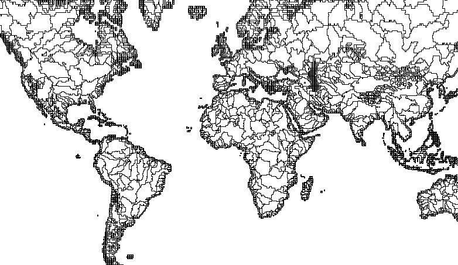
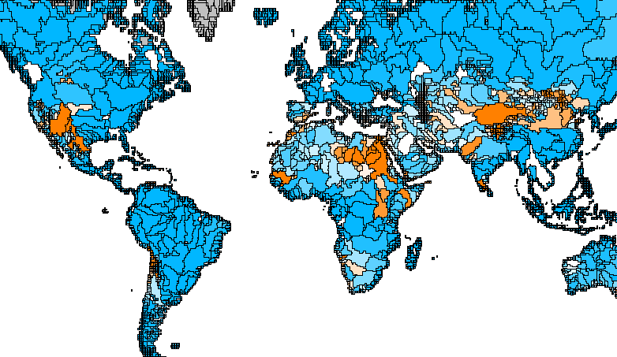

# An SWT Map View
This repository contains a map view that draws GeoJSON features directly on a
[SWT canvas](https://www.eclipse.org/articles/Article-SWT-graphics/SWT_graphics.html).
We will probably use this for regionalization features in openLCA. It supports
multiple web layers, zooming, dragging, colors etc.

## Usage

### Adding a layer

```java
FeatureCollection watersheds = ... ;
Composite parent = ...;
MapView map = new MapView(parent);
map.addLayer(watersheds);
```



### Apply a color scale on a numeric feature parameter

```java
map.addLayer(watersheds)
   .fillScale("Annual non-agri");
```



### Put a layer on top of another layer

```java
map.addLayer(countries);
map.addLayer(streets)
    .fillColor(display.getDefaultColor(SWT.COLOR_RED))
    .center(); // center the 
```